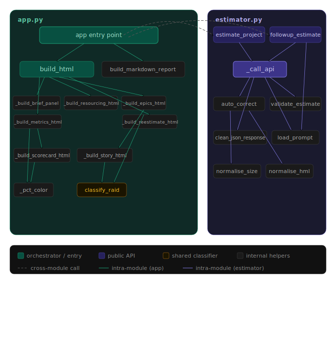

# AI Project Estimator

## The problem this solves

I've spent years watching teams underestimate projects — not because they were careless, but because estimation is usually done informally, assumptions stay implicit, and risks only surface after they've already caused damage.

I started as a software engineer, transitioned into program and project management, and over time ran progressively larger and more complex initiatives. The pattern I kept seeing: teams would commit to a timeline based on a brief conversation, without ever explicitly stating what had to be true for that timeline to hold. When something changed — an integration was more complex than expected, a dependency was unavailable, a requirement was ambiguous — there was no structured way to understand the impact.

This tool applies the analytical framework a senior PM would use — scope decomposition, RAID analysis, explicit assumptions, confidence scoring — and makes it available to anyone with a project brief and five seconds.

---

## What it does

Paste a freeform project brief — a Slack message, a Confluence page, bullet points scribbled before a meeting — and get back a structured estimation report:

- **Timeline range** — optimistic / realistic / pessimistic in weeks, with every assumption made explicit
- **Scope breakdown** — epics and stories sized S/M/L/XL, organized hierarchically
- **RAID log** — Risks, Assumptions, Issues, and Dependencies auto-classified from story content, each graded by probability and impact
- **Resourcing** — roles, FTEs, and red flags (missing roles, single points of failure, bottlenecks)
- **Confidence score** — Low/Medium/High with plain-language rationale and specific actions to increase it
- **Open questions** — the things you need to answer before you can commit to this estimate

Then use **what-if re-estimation** to explore scenarios without starting over:
- *"What if we cut the team in half?"*
- *"What if we drop the Salesforce integration for v1?"*
- *"What if we need to launch in 6 weeks no matter what?"*

Each re-estimate shows exactly what changed from the previous version.

---

## Architecture

```
Brief (freeform text)
        │
        ▼
┌─────────────────┐
│  estimator.py   │  ← prompt construction, API call, JSON parsing
└────────┬────────┘
         │  Claude API (Anthropic)
         │  ▲
         │  └── prompts/system_prompt.txt  ← the "PM brain", version-controlled
         ▼
┌─────────────────┐
│  Structured     │  ← epics, stories, timeline, RAID, confidence, open questions
│  JSON output    │
└────────┬────────┘
         │
         ▼
┌─────────────────┐
│   app.py        │  ← Streamlit UI, interactive tree, dev/prod toggle
│   (Streamlit)   │
└─────────────────┘
         │
         ▼
  Interactive report + JSON/Markdown export
```

**File structure:**
```
ai-project-estimator/
├── app.py                   ← UI: interactive tree rendered via components.html
├── estimator.py             ← API logic, prompt construction, JSON parsing
├── prompts/
│   ├── system_prompt.txt    ← PM expertise encoded as a system prompt
│   └── followup_prompt.txt  ← Re-estimation with change diff tracking
├── examples/
│   ├── sample_brief.txt     ← Example input
│   └── sample_output.json   ← Saved API response for UI development (dev mode)
└── requirements.txt
```



---

## Setup

```bash
git clone https://github.com/YOUR_USERNAME/ai-project-estimator
cd ai-project-estimator
python -m venv .venv
source .venv/bin/activate      # Mac/Linux
pip install -r requirements.txt
```

Create a `.env` file in the project root:
```
ANTHROPIC_API_KEY=your_key_here
```

Get an API key at [console.anthropic.com](https://console.anthropic.com). Add $5 in credits — each estimation call costs roughly $0.10–0.20.

```bash
streamlit run app.py
```

The app opens with a **Dev / Live toggle** in the sidebar. Dev mode loads from `examples/sample_output.json` (no API calls, free). Live mode calls the Claude API with your key.

---

## Design decisions worth noting

**Prompts as version-controlled artifacts.** The system prompt lives in `prompts/system_prompt.txt`, not hardcoded in Python. Every change to the PM logic is a readable git diff. This is how serious AI teams treat prompts — as first-class engineering artifacts.

**Structured JSON output.** The model returns a strictly-typed JSON schema. This decouples estimation logic from the UI entirely — `estimator.py` could power a CLI, Slack bot, or REST API with zero changes. It also makes the output testable.

**RAID classification from story content.** Rather than asking the model to produce a separate RAID log (which doubles the token cost and context), RAID items are classified heuristically from story titles and notes at render time. Risks are inferred from complexity signals, dependencies from integration keywords, assumptions from "existing/standard/reusing" language, issues from explicit problem signals. Imperfect but fast, free, and surprisingly accurate.

**`components.html` for the interactive tree.** Streamlit's native button component applies CSS that can't be reliably overridden — centered text, visible borders, active-state outlines. The entire interactive tree (epics, stories, expand/collapse, RAID detail) is rendered as a single self-contained HTML/JS component. Streamlit only handles the outer chrome. This is a real constraint of building non-standard UIs in Streamlit and the workaround is worth understanding.

**Dev/prod toggle in the sidebar.** Flipping between local JSON and live API without editing code was important for iterating on the UI cheaply. At ~$0.15/call, 20 UI iterations during development would have cost $3. The saved JSON approach made the entire UI iteration cycle free.

---

## What I learned building this

A few things that surprised me:

**Prompt engineering is closer to system design than writing.** The system prompt isn't instructions — it's a specification. Getting the model to return consistent, well-structured JSON with the right level of detail required the same thinking as designing an API contract: what are the inputs, what are the outputs, what invariants must always hold, what should happen in edge cases.

**Token limits bite at the worst time.** A detailed project brief can produce 50+ stories across 9 epics. At 4096 max tokens the JSON would truncate mid-response, producing unparseable output with no obvious error. The fix (bumping to 8096) was trivial — finding it wasn't.

**CSS in Streamlit is a war you can't win.** Streamlit applies component styles after your CSS loads, making `!important` overrides unreliable. The `components.html` approach — rendering a self-contained iframe with its own stylesheet — is the right architectural decision, not a workaround.

**The PM frame makes the AI output more useful.** The model's raw output is decent. The system prompt that encodes PM heuristics — never give a point estimate without a range, always surface hidden complexity, flag anything that sounds underestimated — transforms it into something that actually matches what an experienced PM would produce.

---

## Extending it

- **Slack bot** — wrap `estimate_project()` in a slash command handler; the JSON output maps cleanly to a structured message
- **Jira integration** — auto-create epics and stories from the scope breakdown via the Jira REST API
- **Historical calibration** — feed past project actuals into the system prompt to tune estimates against your team's real velocity
- **Team velocity input** — add a structured field for sprint velocity to anchor timeline estimates to something concrete
- **Confidence trend tracking** — store estimates over time and track how confidence evolves as open questions get answered

---

## Author

**Andrew Gutman**  
MS Computer Science · Career path: Software Engineer → Program/Project Management  
Built as part of a personal AI learning portfolio — applying LLMs to problems I've spent years solving manually.

[GitHub](https://github.com/andymgutman) · [LinkedIn](https://linkedin.com/in/amgtechpm/)
